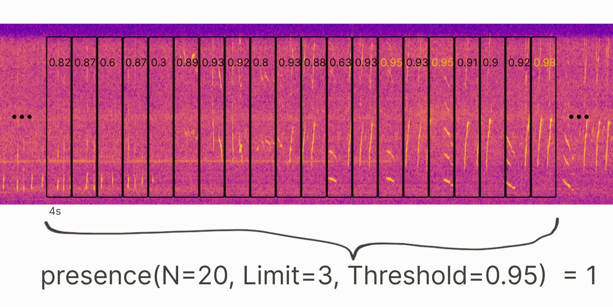
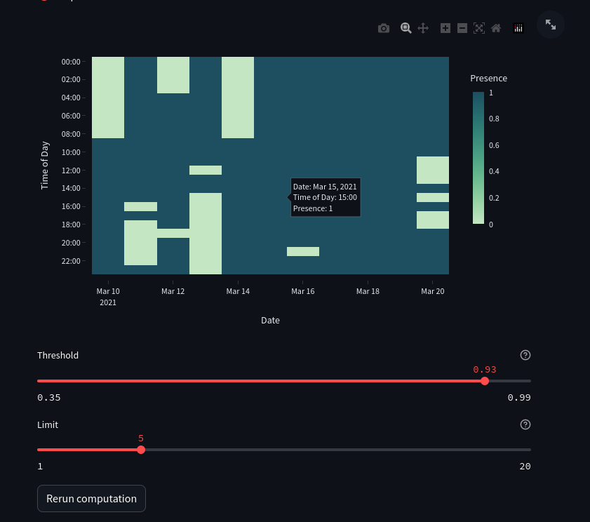

# **acodet** - **Aco**ustic **Det**ector
## Framework for the **usage** and **training** of acoustic species detectors based on deep learning models

---

### ✨ Highlights

- **Integrated graphical user interface (GUI), so no coding required!**
- Import pretrained models from [`bacpipe`](https://github.com/bioacoustic-ai/bacpipe) for classification
- Annotations are generated in **Raven table** format  
  - resulting spreadsheets can be directly imported into raven to view annotations
- Automatic generation of **presence/absence** visualizations  
  - GUI supports interactive visualizations, allowing you to **adjust model thresholds** and instantly view the results
- Interactive **post-processing** methods to reduce false positives
- Headless version included for easy bulk processing and debugging

---

### Sample Output


[__Video tutorials__](https://www.youtube.com/watch?v=bJf4d8qf9h0&list=PLQOW4PvEYW-GNWIYRehs2-4-sa9T20c8A) for installation and usage of the AcoDet GUI  
*(some features have changed and there will be updated tutorials soon)*

The corresponding paper to acodet can be found here:  
👉 https://doi.org/10.1121/10.0025275

---

## 📖 Table of Contents
- [Installation](#installation)
  - [Windows](#windows)
  - [Linux or Mac](#linux-or-mac)
- [Usage](#usage)
  - [GUI](#gui)
    - [Model Selection](#model-selection)
    - [Input Data Selection](#input-data-selection)
    - [Model Settings](#model-settings)
    - [Use Pretrained Linear Classifier](#use-pretrained-linear-classifier)
    - [Inference](#inference)
    - [Outputs](#outputs)
    - [GUI Results Presentation](#gui-results-presentation)
  - [AcoDet Usage Headless](#acodet-usage-headless)
    - [Usecase 1: Generating annotations](#usecase-1-generating-annotations)
    - [Usecase 2: Generating new training data](#usecase-2-generating-new-training-data)
    - [Usecase 3: Training](#usecase-3-training)
- [Explanation of Sequence Limit](#explanation-of-sequence-limit)
- [Citation](#citation)
- [FAQ](#faq)

---

# Installation

## Windows
### Preliminary software installations
- Install [Python 3.11.9](https://www.python.org/ftp/python/3.11.9/python-3.11.9-amd64.exe) – standard install, no admin privileges needed
- Install [Git Bash](https://github.com/git-for-windows/git/releases/download/v2.51.0.windows.1/Git-2.51.0-64-bit.exe) – default install

### Installation instructions
- Create project directory in location of your choice
- Open Git Bash in project directory (right click → *Git Bash here*)
- clone the repository:

`git clone https://github.com/vskode/acodet.git`

- cd (change directory) into acodet:

`cd acodet` 

- Install `uv` (copy and paste in Git Bash console):

`"$HOME/AppData/Local/Programs/Python/Python311/python" -m pip install uv`

- Create a new virtual environment (default name .env_acodet can be changed):

 `uv venv --python 3.11 .env_acodet`

- activate newly created virtual environment (change .env_acodet if necessary):

`source .env_acodet/Scripts/activate`

- Install required packages:

`uv pip install -r pyproject.toml`


--------------------------------------------
## Linux or Mac
### Preliminary software installations:

- Install python 3.11 

    `sudo add-apt-repository ppa:deadsnakes/ppa`

    `sudo apt install python3.11`

- Install git

    `sudo apt install git`

### Installation instructions
- create project directory in location of your choice
- open a terminal in the project directory
- clone the repository:

    `git clone https://github.com/vskode/acodet.git`

- cd into acodet:

    `cd acodet`

- Install uv (copy and paste in terminal):

    `/usr/bin/python/Python311/python -m pip install uv`

- Create a new virtual environment (default name .env_acodet can be changed):

    `uv venv --python 3.11 .env_acodet`

- activate newly created virtual environment (change .env_acodet if necessary):

    `source .env_acodet/bin/activate`

- Install required packages:

    `uv pip install -r pyproject.toml`
    

- Once the repository is installed, I would recommend running the inbuilt tests. That way if all tests run successfully, it is ensured that everything behaves as it should. To run the tests, run the following:

    `pytest -v tests/*`

# Usage

## GUI

AcoDet provides a graphical user interface (GUI) for users to intuitively use the program. All inputs and outputs are handled through the GUI. To run the gui, run (while in acodet directory and virtual environment activated):

`streamlit run streamlit_app.py`

This should start a new tab in a web browser which runs the interface that you can interact with. It is important that your virtual environment where you have installed the required packages is active, for that see the Installation sections. To activate the environment run 

`source .env_acodet/Scripts/activate` (on Windows) 
or 

`source .env_acodet/bin/activate` (on Mac/Linux) 

while your terminal directory is inside **acodet**. 

All inputs of the GUI have little help icons providing explanations about the required inputs.

### Model Selection

- Choose whether to run a model requiring a checkpoint or not

- Depending on your previous choice, AcoDet will list all models supported by bacpipe that either do, or do not require checkpoints

### Input Data Selection

- Depending on your choice you will be prompted to enter the path leading to either your sound files our existing annotation files 
    - Enter a path in the text field that is one directory above the folder you would like to use
    - In the dropdown menu you will be presented with all the folders inside the specified path. Choose the one you would like to work with
    - **Important**: time stamps are required within the file names of the source files for steps 0. and 3.

### Model Settings

- Open the Advanced Settings tab
- specify different configurations
- **Important**: If you selected a model with checkpoint
    - enter the path to the main checkpoint_dir (that's above the model_name-dir containing the actual checkpoint)

### Use Pretrained Linear Classifier

- To select a pretrained linear classifer (for example from bacpipe), set the corresponding setting to `Yes`
- Then, enter the path to the folder containing the linear classifier `.pt` file and the `label2index.json` file (both are saved by `bacpipe` if the `classification` task is set).


### Inference

- If required, choose a Model threshold
- click Run computation
- A progress bar should show the progress of your computations

### Outputs

During inference the model generated annotations will be saved in `../generated_annotations` under a time-stamp named folder corresponding to when you ran the program. Within that folder, you'll find a folder `thresh_0.5` and a `stats.csv` file and a `multiclass_df.csv` file. Within the `thresh_0.5` folder you'll find folder names corresponding to all species classified with a prediction value > 0.5 in the datset. The directory structure within the folder mimics that of the source audio directories. 

The `stats.csv` file contains information on every source audio file, the extracted timestamp from the file name, the number of predictions exceeding 0.8 and 0.9 and the time to process the file.

The `multiclass_df.csv` file contains information on every species that was annotated with prediction values > 0.5, the avg and std confidence, the number of occurrences and the most active audio file.

Aside from the species folder names you'll also find the folder names `multiclass`, `All_Combined` and `analysis` in `thresh_0.5`. In `multiclass`, the annotation files contain the high value prediction label along with the respective value for each context window. In `All_Combined` you'll find annotation files with columns for each species exceeding the threshold in that file. In `analysis` you'll again find all the species folder names and within them `.csv` files and visualizations of presence/absence for the hours within the audio source dataset.

### GUI Results Presentation

- The Output section will provide you with information of the location of the files, and depending on your choice of predifines Settings will show different tabs.
    - the first tab shows the contents of the `stats.csv` and `multiclass_df.csv` files 
    - the second tab: "Annot. Files" gives you a dropdown menu where you can look into prediction values for each vocalization within each source file. By default the threshold for this will be at 0.5, meaning that all sections with prediction values below that will be discarded.
    - the third tab, "Filtered Files" shows the same as the previous tab, however, it only shows sections with previously defined values exceeding the predefined threshold.
    - the forth tab, "Annotation Plots" shows you a visualization revealing the number of anotations per hour in your species/dataset. Choose your species/dataset from the dropdown (in some cases there is only one dataset inside your previously defined folder). Choose `multiclass` to see the entire activity within the dataset.
        - The calculations behind this visualization is explained in [Explanation of Sequence limit](#explanation-of-sequence-limit)
        - You can choose between a "Simple limit" and a "Sequence limit" 
            - the main distinction is whether consecutive vocalizations are required for them to be counted (this should help reduce false positives)
            - the "Simple limit" will compute much faster than the "Sequence limit"
        - You can also change the threshold of the model predictions which will then allow you to update the visualization. If the "Sequence limit" is chosen, the number limit can also be changed, which will change the required number of consecutive vocalizations for them to be counted. (Try it out)
        - All visualizations can be exported as .png files by clicking on the small camera icon in the top right.
    - the fifth tab, "Presence Plots" shows a similar visualization as the previous section, however, only showing binary presence.


## AcoDet usage headless
Users only need to change the files **simple_congif.yml** and **advanced_config.yml** to use AcoDet. Once the config files are changed, users can run the program by running the command `python run.py` inside the **acodet** directory.

### Usecase 1: generating annotations
To generate annotations:
- open the file **simple_config.yml** in any Editor (default is Notepad). 
- change `run_config` to `1`
- change `predefined_settings` to one of the following:
    - `1` for generating annotations with a threshold of 0.5
    - `2` for generating annotations with a custom threshold
        - specify threshold (**thresh**) value in **simple_config.yml** (defaults to 0.9)
    - `3` for generating hourly counts and presence spreadsheets and visualizations (using the sequence criterion and the simple limit)
        - _simple limit_ and _sequence criterion_ are accumulation metrics aiming to deliver hourly presence information, while filtering out false positives
            - _simple limit_ -> only consider annotations if the number of annotations exceeding the **thresh** value is higher than the value for **simple_limit** in **simple_config.yml** (in a given hour in the dataset)
            - _sequence criterion_ -> only consider annotations if the number of consecutive annotations within **sc_con_win** number of windows exceeding the **sc_thresh** value is higher than **sc_limit** (in a given hour in the dataset)
        - hourly counts gives the number of annotations according to the accumulation metrics
        - hourly presence gives a binary (0 -> no whale; 1 -> whale) corresponding to whether the accumulation metrics are satisfied
    - `4` for generating hourly counts and presence spreadsheets and visualizations (using only the simple limit)
    - or `0` to run all of the above in sequence
- change `sound_files_source` to the top level directory containing the dataset(s) you want to annotate

- once finished, save the **simple_config.yml** file

To start the program:
- activate the virtual environment again:

`source env_acodet/Scripts/activate`

- run the run.py script:

`python acodet/run.py`

### Output

The software will now run thorugh your dataset and gerate annotations for every (readable) soundifle within the dataset. While running, a spreadsheet, called stats.csv is continuously updated showing information on the annotations for every file (do not open while program is still running, because the program wont be able to access it).

The program will create a directory called `generated_annotatoins` in the project directory. It will then create a directory corresponding to the date and time that you started the annotation process. Within that directory you will find a directory `thresh_0.5` corresponding to all annotations with a threshold of 0.5. Furthermore you will find the `stats.csv` spreadsheet.

If you have chosen option 2 (or 0) you will also find a directory `thresh_0.x` where the x stands for the custom threshold you specified in the **simple_config.yml** file. Within the `thresh` directories you will find the name of your dataset. 

If you have chosen option 3, 4 or 0 you will find a directory `analysis` within the dataset directory. In that directory you will find spreadsheets for hourly presence and hourly counts, as well as visualizations of the hourly presence and hourly counts.

### Usecase 2: generating new training data

Either use manually created annotations -> option 2, or create new annotations by reviewing the automatically generated annotations -> option 1.

For option 1, use Raven to open sound files alongside their automatically generated annotations. Edit the column `Predictions/Comments` by writing `n` for noise, `c` for call, or `u` for undefined. If the majority of the shown windows are calls, add the suffix `_allcalls` before the `.txt` ending so that the program will automatically label all of the windows as calls, unless specified as `n`, `c`, or `u`. The suffix `_allnoise` will do the same for noise. The suffix `_annotated` will label all unchanged windows as undefined - thereby essentially ignoring them for the created dataset.

Once finished, insert the top-level directory path to the `reviewed_annotation_source` variable in **simple_config.yml**. 

To generate new training data:
- open the file **simple_config.yml** in any Editor (default is Notepad). 
- change `run_config` to `2`
- change `predefined_settings` to one of the following:
    - `1` for generating training data from reviewed annotations
    - `2` for generating training data from manually created training data (space in between annotations will be interpretted as noise)
- change `sound_files_source` to the top level directory containing the dataset(s) containing the sound files

- once finished, save the **simple_config.yml** file

To start the program:
- activate the virtual environment again:

`source env_acodet/Scripts/activate`

- run the run.py script:

`python acodet/run.py`

### Usecase 3: training

To train the model:
- open the file **simple_config.yml** in any Editor (default is Notepad). 
- change `run_config` to `3`
- change `predefined_settings` to one of the following:
    - `1` for generating training data from reviewed annotations

- once finished, save the **simple_config.yml** file
- more adcanced changes for model parameters can be done in **advanced_config.yml**

To start the program:
- activate the virtual environment again:

`source env_acodet/Scripts/activate`

- run the run.py script:

`python acodet/run.py`

# Explanation of Sequence limit
Besides a simple thresholding (simple limit) the sequence limit can be used to distinguish repeating vocalizations from other noise sources. For humpback whales this vastly reduces the number of generated false positives.

To briefly explain:
In a stream of 20 consecutive windows (of approx. 4 s length) you can set limit and threshold. After applying the limit, predictions are only kept if they exceed the threshold and occur in thre frequency set by the limit. This is especially convenient for __hourly presence__ annotations. The below image shows an example of 20 consecutive windows with their given model prediction values. The highlighted values exceed the threshold and since they occur in the required frequency (Limit=3), the hourly presence yield the value 1.



The sequence limit can be useful in noisy environments, where vocalizations are masked by noise and their repetitiveness can be used to distinguish them from irregular background noise.

Threshold and limit can be set interactively and their effect on the data can be analyzed right away. As this is only post-processing the existing annotations, computing time is very fast. The following image shows a screenshot of the sequence limit in the acodet GUI.



# Citation

If you used acodet in your work, please reference the following:

Vincent Kather, Fabian Seipel, Benoit Berges, Genevieve Davis, Catherine Gibson, Matt Harvey, Lea-Anne Henry, Andrew Stevenson, Denise Risch; Development of a machine learning detector for North Atlantic humpback whale song. J. Acoust. Soc. Am. 1 March 2024; 155 (3): 2050–2064.

For bibtex:
```bibtex
@article{10.1121/10.0025275,
    author = {Kather, Vincent and Seipel, Fabian and Berges, Benoit and Davis, Genevieve and Gibson, Catherine and Harvey, Matt and Henry, Lea-Anne and Stevenson, Andrew and Risch, Denise},
    title = "{Development of a machine learning detector for North Atlantic humpback whale song}",
    journal = {The Journal of the Acoustical Society of America},
    volume = {155},
    number = {3},
    pages = {2050-2064},
    year = {2024},
    month = {03},
    issn = {0001-4966},
    doi = {10.1121/10.0025275}
}
```

# FAQ

At the moment the generation of new training data and the training are not yet supported in the graphical user interface.
